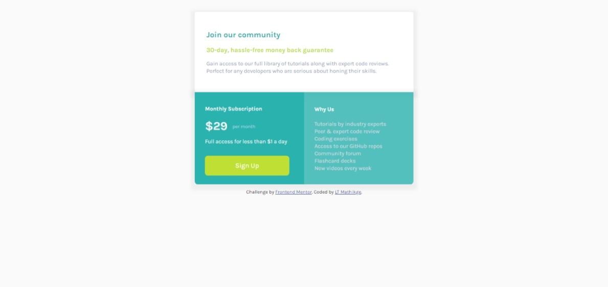
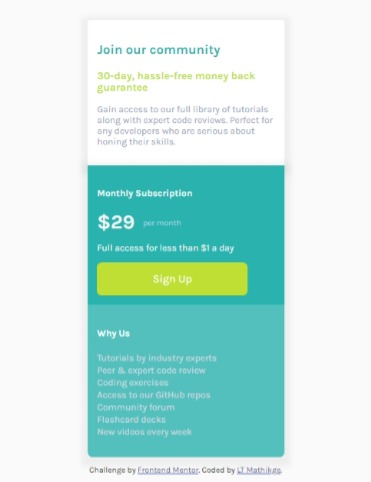

# Frontend Mentor - Single price grid component

## Welcome! 👋

Thanks for checking out this front-end coding challenge.

## Table of contents

- [Overview](#overview)
  - [The challenge](#the-challenge)
  - [Screenshot](#screenshot)
  - [Links](#links)
- [My process](#my-process)
  - [Built with](#built-with)
  - [What I learned](#what-i-learned)
  - [Continued development](#continued-development)
  - [Useful resources](#useful-resources)
- [Author](#author)
- [Acknowledgments](#acknowledgments)

## Overview

## The challenge

Your users should be able to:

- View the optimal layout for the component depending on their device's screen size
- See a hover state on desktop for the Sign Up call-to-action

### Screenshot

### Links

- Solution URL: [https://www.frontendmentor.io/solutions/single-price-grid-flexbox-uplS9st8G](https://www.frontendmentor.io/solutions/single-price-grid-flexbox-uplS9st8G)
- Live Site URL: [https://lt-dev-tag-house.github.io/Single_Price_Grid/](https://lt-dev-tag-house.github.io/Single_Price_Grid/)

## My process

### Built with

- Semantic HTML5 markup
- CSS custom properties
- Flexbox
- Mobile-first workflow

### What I learned

Frontend Mentor always has good challenge designs to build, this was also another good design challenge for me. Key takeaways for this challenge:
- HTML Markup structure **critical**
- I attempted the challenge using Flexbox - I believe the challenge would have been more fun to produce using Grid as this would've helped design the HTML structure in a much cleaner manner.
- As a Frontend developer one needs to be able to pay close attention to the details of the design spec provided and do absolute best to re-produce the same design.

**My approach**
- Build the mock-up with the mobile-design approach.
- Markout sections on the design that will be broken down into my HTML Markup
- Setup basic styles to be used for my typography.

**My challenges**
- Designing the challenge to the spec that was provided.

**Final takeaway**
- Definitely more practice in doing the challenges to get a good hang of building the designs.
- I'm happy on the outcome - there is always room for improvement and I undertake to check other peoples solutions and see how they approached doing this challenge.

### Continued development

- Accessibility
- Media queries
- GRID
- Flexbox 
- CSS Properties: vw, vh etc.

## Author

- Frontend Mentor - [@LT-WebDev](https://www.frontendmentor.io/profile/LT-WebDev)
- Twitter - [@IAM_letlotlo_](https://www.twitter.com/IAM_letlotlo_)

**Have fun building!** 🚀
